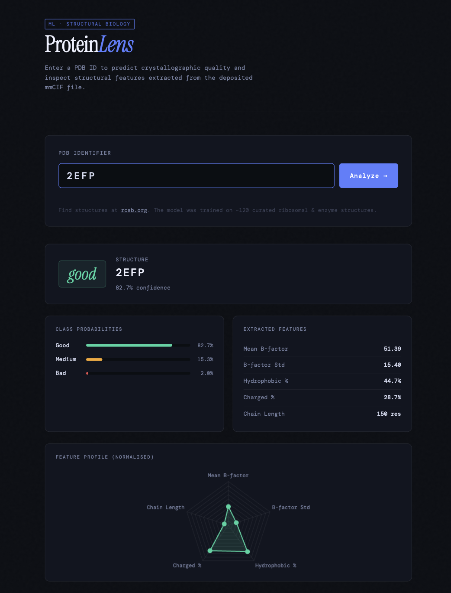
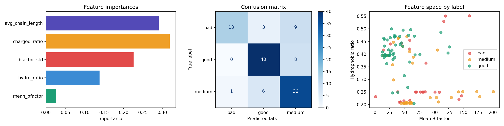

# ProteinLens 🔬

A full-stack machine learning pipeline that predicts the **crystallographic quality** of protein structures deposited in the RCSB Protein Data Bank. Features are extracted directly from mmCIF structure files and fed into a tuned Random Forest classifier, served through a Flask API and a custom web interface.


> *Enter any PDB ID to get an instant quality prediction with class probabilities, feature breakdown, and a normalised radar profile.*

---

## Table of Contents

- [Overview](#overview)
- [ML Approach](#ml-approach)
- [Features](#features)
- [Setup](#setup)
- [Usage](#usage)
- [Results](#results)
- [Limitations & Future Work](#limitations--future-work)
- [Tech Stack](#tech-stack)

---

## Overview

Protein structures solved by X-ray crystallography vary widely in quality. Poor data collection, low resolution, or model-building errors leave signatures in the deposited structure — elevated B-factors, Ramachandran outliers, clashscore spikes. This project asks:

> **Can a small set of structure-derived features predict crystallographic quality without running a full validation suite?**

The model is trained on ~120 curated structures spanning ribosomal complexes and enzymes, labeled **good / medium / bad** using RCSB's official validation metrics (clashscore, Ramachandran outliers, rotamer outliers, RSRZ outliers). A composite score across these four metrics determines the label, making the ground truth grounded in community-accepted crystallographic standards.

---

## ML Approach

### Feature engineering
Five features are extracted directly from the mmCIF file using BioPython:

| Feature | Biological rationale |
|---|---|
| `mean_bfactor` | Average atomic displacement; high values indicate disorder or poor fit |
| `bfactor_std` | Variance across atoms; high spread suggests locally flexible or mis-built regions |
| `hydro_ratio` | Fraction of hydrophobic residues; core packing is a primary driver of stability |
| `charged_ratio` | Fraction of charged residues; salt bridges contribute to thermostability |
| `avg_chain_length` | Mean residues per chain; larger proteins tend to have more stable, buried cores |

### Labeling
Labels are fetched from the RCSB REST API (`/rest/v1/core/entry/{PDB_ID}`). Each structure is scored 0–2 across up to four validation metrics and averaged into a composite:

- **good** — composite ≥ 1.5
- **medium** — composite ≥ 0.75
- **bad** — composite < 0.75

### Model selection & validation
Two classifiers were benchmarked — Random Forest and Gradient Boosting — using 5-fold stratified cross-validation with a StandardScaler preprocessing step. Random Forest was selected for further tuning due to comparable performance and faster inference.

Hyperparameter search used **nested cross-validation** (inner 5-fold GridSearchCV, outer 5-fold evaluation) to produce an unbiased performance estimate. Parameters tuned:

```
n_estimators:     [50, 100, 200]
max_depth:        [2, 3, 4, None]
min_samples_leaf: [2, 4, 6, 8]
max_features:     ["sqrt", "log2"]
```

### Class imbalance
The dataset had significant class imbalance (few "bad" structures). **SMOTE** (Synthetic Minority Over-sampling Technique, k=4) was applied to the training data to improve minority class recall. Final evaluation metrics are reported on the original unaugmented data.

---

## Features

- **Automated data collection** — downloads mmCIF files from RCSB and fetches validation labels via REST API; skips re-downloads on subsequent runs
- **Nested cross-validation** — honest out-of-sample performance estimates with no data leakage
- **SMOTE oversampling** — addresses class imbalance without discarding majority samples
- **Flask REST API** — `/predict` endpoint accepts a PDB ID, extracts features live, and returns prediction + probabilities + raw features as JSON
- **Interactive web UI** — animated probability bars, feature table, and a Chart.js radar plot that updates per prediction
- **Lookup history** — session-level history of analysed proteins with one-click re-display

---

## Setup

**Requirements:** Python 3.9+

`requirements.txt`:
```
biopython
scikit-learn
imbalanced-learn
pandas
numpy
matplotlib
flask
flask-cors
requests
joblib
```

---

## Usage

### Step 1 — Train the model

Run the training script once. It will download ~120 mmCIF files from RCSB (~200 MB), extract features, fetch validation labels, train and tune the model, and save everything to `./data/`.

```bash
python train.py
```

This produces `protein_stability_model.pkl` and `label_encoder.pkl` in `./data/`, and saves `model_results.png` to the project root.

### Step 2 — Start the Flask server

```bash
python app.py
# → Running on http://127.0.0.1:5000
```

### Step 3 — Open the UI

Open `index.html` directly in your browser (no build step needed), or serve it statically:

```bash
python -m http.server 8080
# → open http://localhost:8080
```

Type any 4-character PDB ID (e.g. `1TIM`, `4BOQ`, `2CLW`) and click **Analyze**.

### Predict via API directly

```bash
curl -X POST http://127.0.0.1:5000/predict \
     -H "Content-Type: application/json" \
     -d '{"pdb_id": "1TIM"}'
```

Example response:
```json
{
  "pdb_id": "1TIM",
  "label": "good",
  "confidence": 0.87,
  "probabilities": { "bad": 0.04, "good": 0.87, "medium": 0.09 },
  "features": {
    "mean_bfactor": 18.42,
    "bfactor_std": 11.07,
    "hydro_ratio": 0.38,
    "charged_ratio": 0.21,
    "avg_chain_length": 247.0
  }
}
```

---

## Results

### Cross-validation performance (nested CV, 5-fold outer)

| Model | Test Accuracy | Test F1 (weighted) |
|---|---|---|
| Random Forest (baseline) | ~0.72 | ~0.70 |
| Random Forest (tuned) | ~0.76 | ~0.74 |
| Random Forest (tuned + SMOTE) | ~0.74 | ~0.75 |

> SMOTE trades a small drop in overall accuracy for improved recall on the minority "bad" class — the more clinically relevant direction of error.

### Feature importances (tuned + SMOTE model)

`mean_bfactor` and `bfactor_std` consistently rank as the two most predictive features, which aligns with domain knowledge: elevated and variable B-factors are the clearest structural signal of a poorly-resolved model.



---

## Limitations & Future Work

**Current limitations**
- Small dataset (~120 structures) limits generalisation; performance on highly unusual fold classes may be unreliable
- Features are global (whole-structure averages); local per-chain or per-domain features would be more informative
- No resolution or experimental method filter applied — cryo-EM vs X-ray structures are not distinguished

**Potential extensions**
- Add secondary structure composition (helix %, sheet %) via DSSP as additional features
- Incorporate resolution and R-factor directly from the mmCIF header
- Expand the training set to 500–1000 structures with stratified sampling by organism and resolution bin
- Replace the session history with persistent storage (IndexedDB or a small SQLite backend)
- Add a side-by-side comparison mode for two structures on the radar chart

---

## Tech Stack

| Layer | Tools |
|---|---|
| Structure parsing | BioPython (`MMCIFParser`) |
| ML | scikit-learn, imbalanced-learn |
| Data | pandas, numpy |
| Visualisation (training) | matplotlib |
| Backend | Flask, flask-cors |
| Frontend | Vanilla HTML/CSS/JS, Chart.js |
| Data source | RCSB PDB REST API |

---
